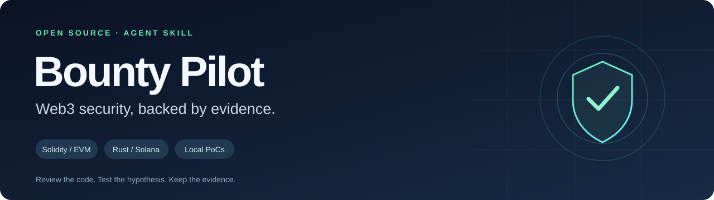

<p align="center"></p>

<h1 align="center">Bounty Pilot</h1>
<p align="center"><strong>Навык для ИИ-агентов: аудит смарт-контрактов и исследование Web3-багбаунти.</strong><br>От ссылки на проект — к гипотезе, локальному PoC и приватному черновику репорта.</p>
<p align="center"><a href="README.md">English</a> · <strong>Русский</strong> · <a href="LICENSE">Лицензия MIT</a></p>

---

## Что это

Bounty Pilot задаёт coding-агенту последовательный процесс: разобраться в проекте, определить scope, исследовать потенциальные ошибки, проверить их тестами и подготовить репорт.

Он состоит из двух половин, и обе определяют, найдётся ли вообще что-нибудь:

- **Воронка** решает, где смотреть и что считать доказательством: стоит ли цель недели, какой код последний аудит не видел, какие поверхности уже сожжены опубликованными известными проблемами, и совпадает ли байткод в мейннете с тем, что ты читаешь.
- **Охота** — тринадцать прицельных линз, выбираемых по типу протокола и запускаемых из собранных бандлов по разным проходам, где генерация и опровержение намеренно разделены: агент, который опровергает себя во время охоты, находит меньше, а агент, который не опровергает себя никогда, подаёт репорты, которые убивает триаж.
- **Двухраундовый обмен возражениями** после охоты: триаж-агенту сказано отклонять находки, и **каждое возражение обязано быть доказано** — цитатой кода, цитатой спецификации, названным тестом или живым чтением чейна. Ответы тоже обязаны быть доказаны. Бремя одинаковое с двух сторон, потому что односторонний разбор отклоняет почти всё, и ты никогда не узнаешь, какое отклонение было ошибкой.

**Это навык для агента с инструментами, а не отдельный онлайн-сканер.** Он ориентирован на Web3-проекты: EVM, Solana и смешанные репозитории с контрактами, релеерами, keeper-ами и сервисами. Для Move, Cairo и CosmWasm есть маршрутизация по стеку, но скилл честно отмечает, где пока нет специализированной линзы. Python-скрипты помогают собрать контекст, проверить развёртывание и структуру; сами по себе они уязвимости не ищут и не доказывают.

## Запуск за минуту

**1. Отправь агенту команду**, заменив `OWNER/TARGET` на нужный проект:

```text
Install https://github.com/dimin4241-svg/bounty-pilot
and run Bounty Pilot on https://github.com/OWNER/TARGET.
Read skills/bounty-pilot/SKILL.md and follow it.
Keep findings private. Explain results in Russian.
```

**2. После установки для следующего проекта достаточно:**

```text
Bounty Pilot: https://github.com/OWNER/TARGET
```

Можно приложить ссылку на bounty-программу. Без неё анализ исходников начнётся, но пригодность находки для подачи и выплаты останется неподтверждённой.

<details>
<summary><strong>Если агент не умеет устанавливать skills автоматически</strong></summary>

Склонируй репозиторий:

```sh
git clone https://github.com/dimin4241-svg/bounty-pilot.git
```

Затем попроси агента прочитать файл:

```text
Прочитай /полный/путь/bounty-pilot/skills/bounty-pilot/SKILL.md
и используй этот навык для аудита моего проекта.
```

Либо скопируй каталог `skills/bounty-pilot` в поддерживаемую клиентом папку навыков. Точный путь зависит от агента и версии. Перед заменой существующей установки просмотри изменения.

</details>

## Что он делает

| Этап | Главный вопрос | Результат |
| --- | --- | --- |
| 0. Отбор цели | Стоит ли эта цель недели? | Приоритет, причины и честный список неизвестного |
| 1. Исходные данные | Какой код, какая программа, и что реально задеплоено? | Scope, коммит, карта дублей, сравнение байткода |
| 2. Модель | Что должно сохраняться, и чего аудит не видел? | Инварианты, границы доверия, ранжированная дельта |
| 3. Охота | Где эти свойства могут сломаться? | Кандидаты, следы и зафиксированное покрытие |
| 4. Опровержение | Выживет ли утверждение под атакой на него? | Шесть гейтов: прерывание, достижимость, триггер, ущерб, право на подачу и доказательства |
| 5. Воспроизведение | Показывает ли это оригинальный исходник? | Локальный PoC, логи, контрольный сценарий |
| 6. Новизна | Это уже опубликовано? | Процитированные источники, совпадения с картой дублей |
| 7. Выдача | Что подтверждено? | Приватный черновик, ограничения, следующий эксперимент |

### Линзы охоты

| Линза | Ось атаки |
| --- | --- |
| `privileged-path` | **Полномочия** — как *непривилегированный* актор дотягивается до привилегированной власти |
| `external-call` | **Произвольные цели** — вызов по адресу и калldata от вызывающего рядом с висящими approve |
| `economics` | **Выполнимость** — капитал, цена манипуляции, извлечение, чистая прибыль, по живым числам |
| `upgrade` | **Версии** — коллизии storage, неинициализированные реализации, админы прокси |
| `delta` | **Время** — код, которого последний аудит не видел |
| `upstream-diff` | **Происхождение** — отклонение форка от канонического апстрима |
| `coverage-gap` | **Наблюдаемость** — где тесты врут, включая мок, подменяющий то, что и тестируется |
| `accounting` | **Агрегаты** — перечисление всех писателей каждого `total*` |
| `live-reality` | **Истина** — константы и конфиг против живого состояния чейна |
| `integration-auth` | **Границы** — какие параметры колбэка подконтрольны атакующему |
| `liveness` | **Необратимость** — дешёвый неотменяемый отказ без привилегий |
| `anchor-account` | **Solana** — подмена аккаунтов, PDA-сиды, полномочия CPI |
| `seam` | **Комбинации** — механизмы, не видимые ни одной линзе по отдельности, и отказы, которые стоит пересмотреть |

Проходы различаются **целью**, а не усилием. Прицеливание дешёвое и механическое — диффы, манифесты, тестовые файлы — и даёт ранжированный порядок чтения, а не находки. Затем атакующие проходы ведут механизменные линзы по этому ранжированию, каждая из собранного бандла: SOP чтения кода, общие правила, процедура линзы, контекст прогона и весь исходник в scope:

```sh
python3 skills/bounty-pilot/scripts/bounty.py bundle \
  --repo /path/to/target --run run --lens attack --scope src/ --include run/delta.json
```

Один бандл на линзу, один агент на бандл, каждый в своём контексте. Независимые прочтения могут находить разные механизмы, но также могут повторять друг друга и расходовать бюджет. Поэтому учитывай уникальные пути и гипотезы, а ценность повторного запуска проверяй на отложенных бэктестах. Между проходами в `known-hypotheses.md` записываются исследованные механизмы, непроверенные пути и следующий эксперимент для каждой открытой гипотезы.

Бюджет по умолчанию — **до трёх стадий**, примерно 18 прочтений плюс триаж. Остановка — по бюджету либо после двух проходов подряд, не давших ни нового м
